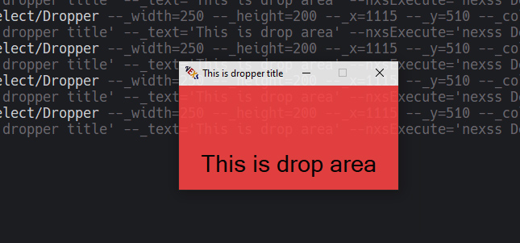

# Input/Dropper

Allows to run any command after drop. It can be **nexss** or any command however must be able to receive nxsIn field data.



```sh
nexss Select/Dropper --_width=250 --_height=200 --_x=1115 --_y=510
nexss Select/Dropper --_color=ff4444 --_trans=220 --_autosize=1
nexss Select/Dropper --_trans=220 --_autosize=1 --_title='This is dropper title' --_text='This is drop area'
nexss Select/Dropper --nxsExecute='nexss Debug'
# Below will execute command after drop the file.
# If you drop multiple files the field will contain one value with separated /n
# TODO: Convert to Array/JSON
nexss Select/Dropper --_title='This is dropper title' --_text='This is drop area' --nxsExecute='nexss Debug'
```
